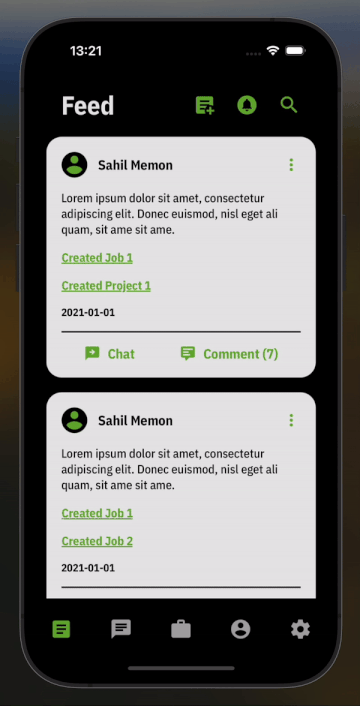

# dutified-mobile

A talent sourcing and fund raising marketplace where users can create projects, hire users, and raise fund for their projects.

## Tech Stack

Currently a WIP, the front-end is built upon React Native and Zustand (light-weight state management), job payment transactions are processed using Stripe.

The backend is essentially a collection of Firebase tools + a Google Cloud Platform database that stores user and project data.

-   TypeScript
-   React Native
-   Firebase
-   Google Cloud Platform
-   Stripe API
-   OpenAI API

### Firebase Note

Not all React Native Firebase packages have Expo config plugins provided yet. You may see if a module is supported by checking if it contains the app.plugin.js file in its package directory.
